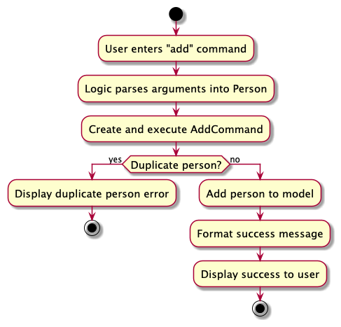
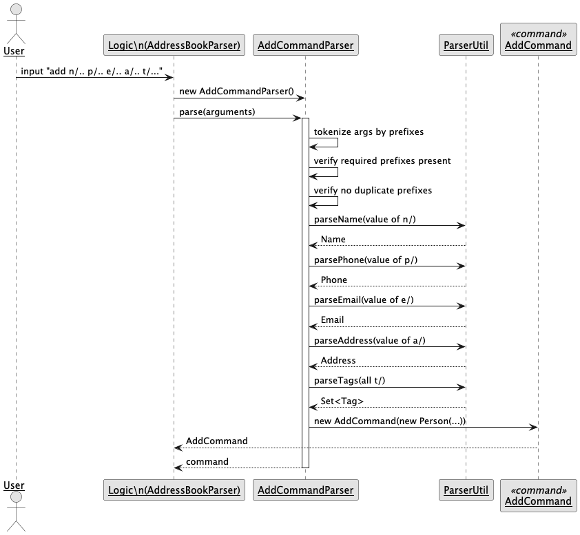
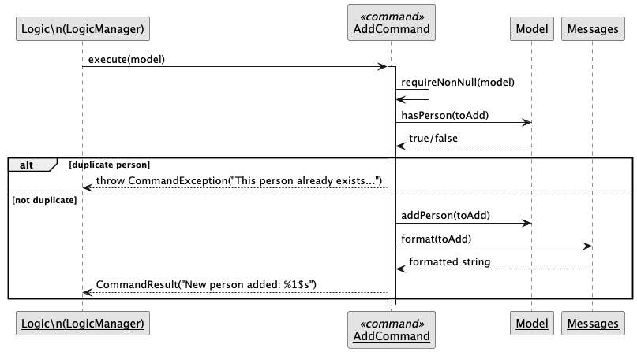
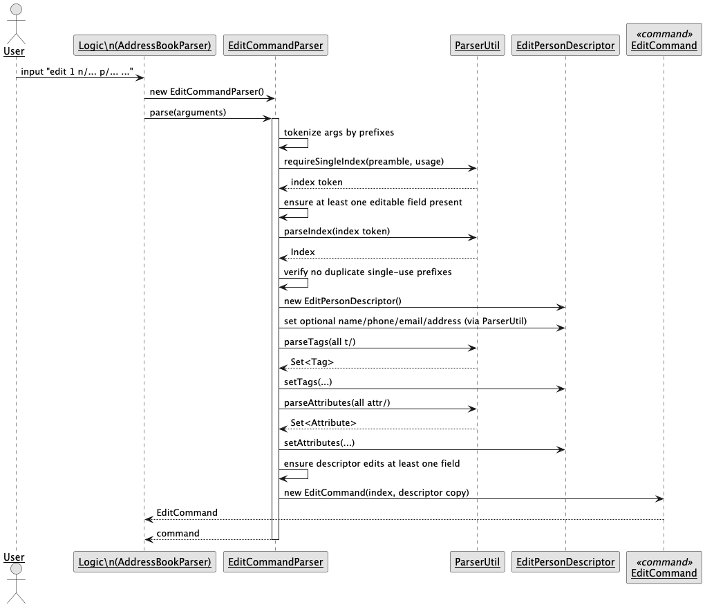
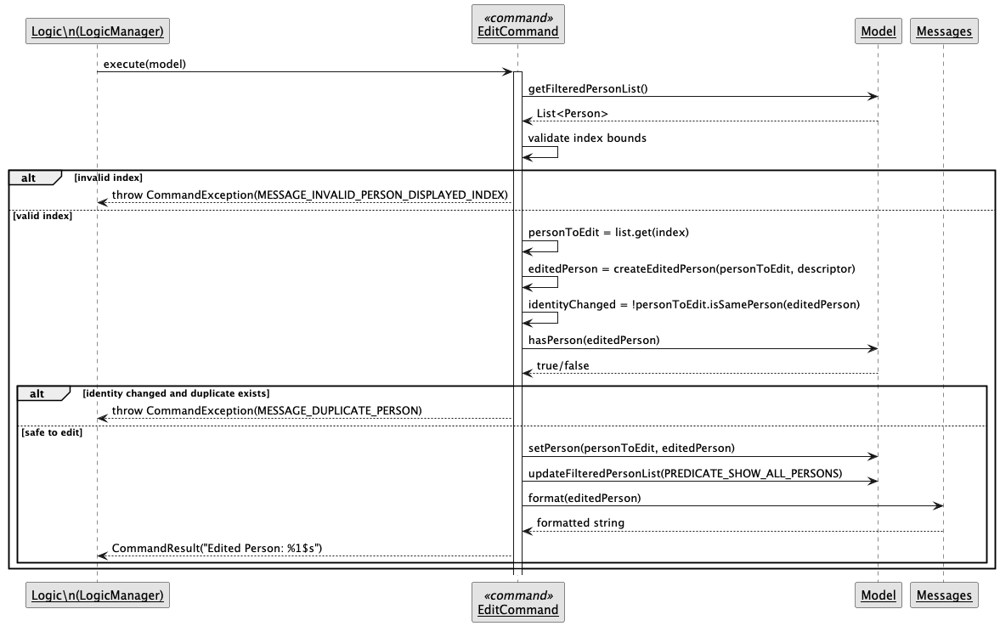
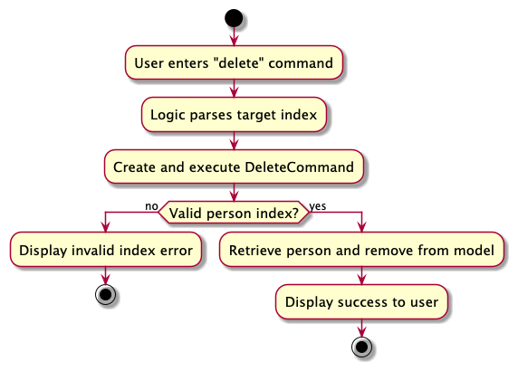
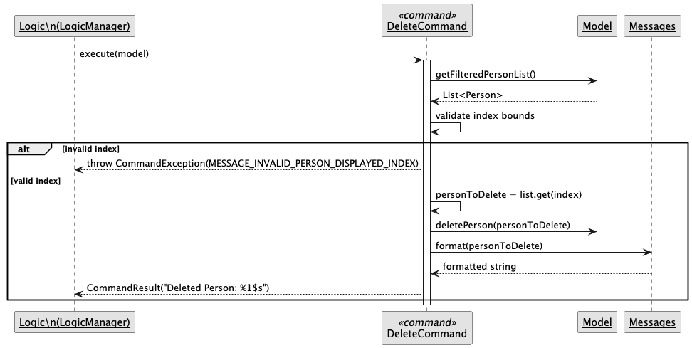

---
layout: page
title: ClassRosterPro Developer Guide
---
* Table of Contents
{:toc}
--------------------------------------------------------------------------------------------------------------------

## **Acknowledgements**

* This project is adapted from SE-EDU's AddressBook-Level3 (AB3). We reused its architecture, code structure, and portions of documentation with modifications to suit our domain. See: AB3 repository (`https://github.com/se-edu/addressbook-level3`), UG, and DG.
* The command-parsing pattern and some utility classes are reused from AB3 with changes. Parser overview diagram concept adapted from AB3 `ParserClasses`.
* PlantUML is used for UML diagrams. Graphviz is used for rendering.

--------------------------------------------------------------------------------------------------------------------

## **Setting up, getting started**

Refer to the guide [_Setting up and getting started_](SettingUp.md).

--------------------------------------------------------------------------------------------------------------------

## **Design**

### Architecture

The ***Architecture Diagram*** given above explains the high-level design of the App.

Given below is a quick overview of main components and how they interact with each other.

**Main components of the architecture**

**`Main`** (consisting of classes [`Main`](https://github.com/AY2526S1-CS2103T-W13-4/tp/blob/master/src/main/java/seedu/address/Main.java) and [`MainApp`](https://github.com/AY2526S1-CS2103T-W13-4/tp/blob/master/src/main/java/seedu/address/MainApp.java)) is in charge of the app launch and shut down.
* At app launch, it initializes the other components in the correct sequence, and connects them up with each other.
* At shut down, it shuts down the other components and invokes cleanup methods where necessary.

The bulk of the app's work is done by the following four components:

* [**`UI`**](#ui-component): The UI of the App.
* [**`Logic`**](#logic-component): The command executor.
* [**`Model`**](#model-component): Holds the data of the App in memory.
* [**`Storage`**](#storage-component): Reads data from, and writes data to, the hard disk.

[**`Commons`**](#common-classes) represents a collection of classes used by multiple other components.

**How the architecture components interact with each other**

The *Sequence Diagram* below shows how the components interact with each other for the scenario where the user issues the command `delete 1`.

Each of the four main components (also shown in the diagram above),

* defines its *API* in an `interface` with the same name as the Component.
* implements its functionality using a concrete `{Component Name}Manager` class (which follows the corresponding API `interface` mentioned in the previous point.

For example, the `Logic` component defines its API in the `Logic.java` interface and implements its functionality using the `LogicManager.java` class which follows the `Logic` interface. Other components interact with a given component through its interface rather than the concrete class (reason: to prevent outside component's being coupled to the implementation of a component), as illustrated in the (partial) class diagram below.

The sections below give more details of each component.

### UI component

The **API** of this component is specified in [`Ui.java`](https://github.com/AY2526S1-CS2103T-W13-4/tp/blob/master/src/main/java/seedu/address/ui/Ui.java)

The UI consists of a `MainWindow` that is made up of parts e.g.`CommandBox`, `ResultDisplay`, `PersonListPanel`, `StatusBarFooter` etc. All these, including the `MainWindow`, inherit from the abstract `UiPart` class which captures the commonalities between classes that represent parts of the visible GUI.

The `UI` component uses the JavaFx UI framework. The layout of these UI parts are defined in matching `.fxml` files that are in the `src/main/resources/view` folder. For example, the layout of the [`MainWindow`](https://github.com/se-edu/addressbook-level3/tree/master/src/main/java/seedu/address/ui/MainWindow.java) is specified in [`MainWindow.fxml`](https://github.com/se-edu/addressbook-level3/tree/master/src/main/resources/view/MainWindow.fxml)

The `UI` component,

* executes user commands using the `Logic` component.
* listens for changes to `Model` data so that the UI can be updated with the modified data.
* keeps a reference to the `Logic` component, because the `UI` relies on the `Logic` to execute commands.
* depends on some classes in the `Model` component, as it displays `Person` object residing in the `Model`.

### Logic component

**API** : [`Logic.java`](https://github.com/AY2526S1-CS2103T-W13-4/tp/blob/master/src/main/java/seedu/address/logic/Logic.java)

Here's a (partial) class diagram of the `Logic` component:

The sequence diagram below illustrates the interactions within the `Logic` component, taking `execute("delete 1")` API call as an example.

:information_source: **Note:** The lifeline for `DeleteCommandParser` should end at the destroy marker (X) but due to a limitation of PlantUML, the lifeline continues till the end of diagram.

How the `Logic` component works:

1. When `Logic` is called upon to execute a command, it is passed to an `AddressBookParser` object which in turn creates a parser that matches the command (e.g., `DeleteCommandParser`) and uses it to parse the command.
1. This results in a `Command` object (more precisely, an object of one of its subclasses e.g., `DeleteCommand`) which is executed by the `LogicManager`.
1. The command can communicate with the `Model` when it is executed (e.g. to delete a person). 
   Note that although this is shown as a single step in the diagram above (for simplicity), in the code it can take several interactions (between the command object and the `Model`) to achieve.
1. The result of the command execution is encapsulated as a `CommandResult` object which is returned back from `Logic`.

Here are the other classes in `Logic` (omitted from the class diagram above) that are used for parsing a user command:

How the parsing works:
* When called upon to parse a user command, the `AddressBookParser` class creates an `XYZCommandParser` (`XYZ` is a placeholder for the specific command name e.g., `AddCommandParser`) which uses the other classes shown above to parse the user command and create a `XYZCommand` object (e.g., `AddCommand`) which the `AddressBookParser` returns back as a `Command` object.
* All `XYZCommandParser` classes (e.g., `AddCommandParser`, `DeleteCommandParser`, ...) inherit from the `Parser` interface so that they can be treated similarly where possible e.g, during testing.

### Model component
**API** : [`Model.java`](https://github.com/AY2526S1-CS2103T-W13-4/tp/blob/master/src/main/java/seedu/address/model/Model.java)

The `Model` component,

* stores the address book data i.e., all `Person` objects (which are contained in a `UniquePersonList` object).
* stores the currently 'selected' `Person` objects (e.g., results of a search query) as a separate _filtered_ list which is exposed to outsiders as an unmodifiable `ObservableList<Person>` that can be 'observed' e.g. the UI can be bound to this list so that the UI automatically updates when the data in the list change.
* stores a `UserPref` object that represents the user’s preferences. This is exposed to the outside as a `ReadOnlyUserPref` objects.
* does not depend on any of the other three components (as the `Model` represents data entities of the domain, they should make sense on their own without depending on other components)

### Storage component

**API** : [`Storage.java`](https://github.com/AY2526S1-CS2103T-W13-4/tp/blob/master/src/main/java/seedu/address/storage/Storage.java)

The `Storage` component,
* can save both address book data and user preference data in JSON format, and read them back into corresponding objects.
* inherits from both `AddressBookStorage` and `UserPrefStorage`, which means it can be treated as either one (if only the functionality of only one is needed).
* depends on some classes in the `Model` component (because the `Storage` component's job is to save/retrieve objects that belong to the `Model`)

### Common classes

Classes used by multiple components are in the `seedu.address.commons` package.

--------------------------------------------------------------------------------------------------------------------

## **Implementation**

This section describes some noteworthy details on how certain features are implemented.

### Help Command

#### What it does

Shows the in-app help window with a curated command summary so tutors can quickly recall syntax without leaving the application.

#### Execution walkthrough

When a user enters `help`, `LogicManager` instantiates `HelpCommand`. The command returns a `CommandResult` that sets the `showHelp` flag to `true`, instructing the UI to open (or refocus) the help window. The textual summary displayed comes from `HelpCommand.SHOWING_HELP_MESSAGE`.

#### Design considerations

- Keep help content in code to guarantee the window works even when offline.
- The window opens idempotently—the same command simply refocuses the existing help stage instead of spawning duplicates.
- The `CommandResult` flagging approach keeps UI behaviour configurable without introducing UI dependencies into the logic layer.

### Add Command

#### What it does

Creates a new student entry with core contact information and optional tags. This is the primary way tutors build the roster.

#### Execution walkthrough

`AddressBookParser` delegates `add` commands to `AddCommandParser`, which tokenises by CLI prefixes, validates each mandatory field, and constructs a `Person`. `AddCommand#execute(Model)` then checks for duplicates via `model.hasPerson`; if none are found, `model.addPerson` is called and a success message is returned.

#### Design considerations

- Input validation happens during parsing so users see errors before the model is mutated.
- Duplicate detection relies on `Person#isSamePerson`, ensuring identity rules stay centralised in the model.
- For a detailed diagrammatic breakdown, see the subsequent **Add Student Command** section.

### List Command

#### What it does

Resets the student list back to the full roster after filters, searches, or attribute-based queries.

#### Execution walkthrough

`ListCommand#execute(Model)` invokes `model.updateFilteredPersonList(Model.PREDICATE_SHOW_ALL_PERSONS)`, restoring the observable list that backs the UI. The command then returns a simple confirmation message; no data is mutated.

#### Design considerations

- The command runs in O(n) because the filtered list wraps the master list—no deep copies are made.
- Display logic stays in the UI; `ListCommand` only manipulates the predicate to maintain separation of concerns.
- Returning an explicit acknowledgement helps the user confirm that the reset completed.

### Open Command

#### What it does

Expands a student's card in the UI so tutors can inspect lessons, grades, tags, and other extended details.

#### Execution walkthrough

`OpenCommand` resolves the target index against the current filtered list. It ensures the index is valid and that the card is not already expanded, then toggles the `Person`'s `expandedProperty` to `true`. The bound UI updates automatically and the command returns a confirmation message.

#### Design considerations

- Expansion state lives on the `Person` object, keeping UI behaviour consistent even when the list is resorted or filtered.
- Guard clauses prevent redundant state flips and provide clear error messages when the card is already open.
- Operations stay synchronous; no additional events or asynchronous callbacks are required.

### Close Command

#### What it does

Collapses an expanded student card to restore the compact list view.

#### Execution walkthrough

Similar to `OpenCommand`, `CloseCommand` validates the index, checks that the card is currently open, and flips the `expandedProperty` to `false`. A confirmation message indicates success; otherwise a descriptive error is thrown.

#### Design considerations

- Mirroring the open logic keeps the commands complementary and predictable.
- Using the same `expandedProperty` ensures toggling works regardless of how the card was opened (command or future UI triggers).
- Input validation reuses `Messages.MESSAGE_INVALID_PERSON_DISPLAYED_INDEX`, maintaining a consistent error vocabulary across commands.

### Clear Command

#### What it does

Wipes the entire roster, removing every stored student and resetting the dataset to a blank state.

#### Execution walkthrough

`ClearCommand#execute(Model)` constructs a new empty `AddressBook` instance and passes it to `model.setAddressBook(...)`. Because the model exposes an observable list, the UI immediately reflects the cleared roster. A confirmation message is returned to the user.

#### Design considerations

- The operation is destructive; users should be advised to back up data before running it. Undo is not available.
- Creating a fresh `AddressBook` is simpler than iterating through students, keeping the command O(1) relative to roster size.
- By reusing the setter in `Model`, storage and persistence layers automatically pick up the new state on the next save cycle.

### Exit Command

#### What it does

Terminates the application gracefully after acknowledging the user's request.

#### Execution walkthrough

`ExitCommand` returns a `CommandResult` with the `exit` flag set to `true`. `LogicManager` forwards this to the UI, which listens for the flag and triggers application shutdown while allowing final persistence tasks (e.g., saving preferences) to complete.

#### Design considerations

- The command never throws; exiting is always considered successful.
- Using flags in `CommandResult` keeps lifecycle management in the UI layer, avoiding logic-to-UI coupling.
- Any cleanup (saving logs, closing windows) can be centralised in the UI's response to the flag rather than scattered across commands.

### Add Student Command

#### What it does

Registers a new student in the roster. The created `Person` initially has empty remark, grade, and lesson lists; tags may be provided to group students immediately.

#### Parameters

`add n/NAME p/PHONE e/EMAIL a/ADDRESS [t/TAG]...`

- `n/` — required. Full student name; validated by `Name#isValidName`.
- `p/` — required. Contact number; must satisfy `Phone#isValidPhone`.
- `e/` — required. Email address; checked by `Email#isValidEmail`.
- `a/` — required. Free-form postal address.
- `t/` — optional, repeatable. Adds tags; each value must satisfy `Tag#isValidTagName`.

The command rejects missing mandatory prefixes, duplicate occurrences of the same mandatory prefix, and malformed values.

#### Overview

The `add` command follows the standard command pattern of *parse → construct command → execute on the model*.

#### High-level flow

The activity diagram captures the user journey: the tutor submits the command, the system validates the input, and either reports a duplicate or persists the new student before confirming success.

#### Parsing pipeline

The sequence diagram shows how control moves from `LogicManager` to `AddressBookParser` and finally to `AddCommandParser`. The parser:

1. Tokenises the raw arguments by prefixes (`n/`, `p/`, `e/`, `a/`, `t/`).
2. Ensures the preamble is empty and every mandatory prefix appears exactly once.
3. Delegates to `ParserUtil` to construct domain objects (`Name`, `Phone`, `Email`, `Address`, `Tag`).
4. Builds a `Person` with default `Remark`, `LessonList`, and `GradeList`, and returns a fully initialised `AddCommand`.

Key classes: `AddCommandParser`, `ParserUtil`, `Person`.

#### Execution behaviour

The sequence diagram documents the runtime checks when `AddCommand#execute(Model)` is invoked. The command:

1. Calls `model.hasPerson(toAdd)` to guard against duplicates.
2. Throws `CommandException` with `MESSAGE_DUPLICATE_PERSON` if a match exists.
3. Otherwise adds the student via `model.addPerson(toAdd)` and formats the success message through `Messages.format`.

Key classes: `AddCommand`, `Model`, `Messages`.

#### Validation and error handling

- Missing or repeated mandatory prefixes trigger `ParseException` with usage guidance.
- Invalid value formats (e.g., phone, email) are rejected by the respective domain constructors inside `ParserUtil`.
- Duplicate students—based on the `Person#isSamePerson` identity definition—are blocked during execution.

### Edit Student Command

#### What it does

Updates selected fields of an existing student without replacing the whole entry. Fields omitted from the command remain unchanged.

#### Parameters

`edit INDEX [n/NAME] [p/PHONE] [e/EMAIL] [a/ADDRESS] [t/TAG]... [attr/KEY=VALUE]...`

- `INDEX` — required, 1-based. Identifies the student in the current filtered list.
- `n/`, `p/`, `e/`, `a/` — optional single-occurrence fields; if present, must pass the same validators as `add`.
- `t/` — optional, repeatable; replaces the tag set when provided. Supplying a lone `t/` clears all tags.
- `attr/` — optional, repeatable; replaces the attribute set. Supplying `attr/` with an empty value clears attributes.

At least one field beyond the index must be provided; otherwise the command rejects the input.

#### Overview

The edit command follows the same *parse → command → execute* pattern as other logic features.

#### High-level flow

The activity diagram illustrates the conditional checks: field presence, index validation, duplicate detection, and final update.

#### Parsing pipeline

The sequence diagram shows how `AddressBookParser` delegates to `EditCommandParser`. The parser:

1. Tokenises optional fields and isolates the index preamble.
2. Verifies that at least one editable field was supplied.
3. Parses the index and checks for duplicate single-use prefixes.
4. Builds an `EditPersonDescriptor`, parsing tags and attributes through `ParserUtil`.
5. Ensures the descriptor contains changes before instantiating `EditCommand`.

Key classes: `EditCommandParser`, `EditPersonDescriptor`, `ParserUtil`.

#### Execution behaviour

The sequence diagram  captures the runtime flow:

1. Fetch the targeted student from the filtered list and guard against invalid indices.
2. Produce an edited `Person` by merging descriptor values with the original.
3. If the identity changes and clashes with another student, throw `MESSAGE_DUPLICATE_PERSON`.
4. Otherwise replace the entry, refresh the list, and return a success message.

Key classes: `EditCommand`, `Model`, `Messages`.

#### Validation and error handling

- Missing optional fields trigger `MESSAGE_NOT_EDITED`.
- Invalid indices reuse the shared index error message.
- Identity conflicts are blocked before the model is mutated.

### Delete Student Command

#### What it does

Removes a student from the roster using their displayed index.

#### Parameters

`delete INDEX`

- `INDEX` — required, 1-based. Must reference an entry in the current filtered list.

#### Overview

Deletion is the simplest command flow: parse the index, resolve it against the filtered list, and delete the matching person.

#### High-level flow

The activity diagram highlights the single decision point—whether the supplied index is valid.

#### Parsing pipeline

The sequence diagram  shows the brief parser interaction: `requireSingleIndex`, `parseIndex`, then creation of a `DeleteCommand`.

Key classes: `DeleteCommandParser`, `ParserUtil`.

#### Execution behaviour

The sequence diagram  depicts the execution: retrieve the filtered list, guard against invalid indices, remove the student through `model.deletePerson`, and format a confirmation message with `Messages.format`. Key classes: `DeleteCommand`, `Model`, `Messages`.

#### Validation and error handling

- Invalid indices throw `MESSAGE_INVALID_PERSON_DISPLAYED_INDEX`.
- Because the command is irreversible, consider pairing it with undo when available.

--------------------------------------------------------------------------------------------------------------------

## **Documentation, logging, testing, configuration, dev-ops**

* [Documentation guide](Documentation.md)
* [Testing guide](Testing.md)
* [Logging guide](Logging.md)
* [Configuration guide](Configuration.md)
* [DevOps guide](DevOps.md)

--------------------------------------------------------------------------------------------------------------------

## **Appendix: Requirements**

## **1. Product Scope (Target User & Value Proposition)**

### **Target User Profile**

Private tutors and small teaching teams who manage many students without the infrastructure of a tuition agency and need a fast, keyboard-driven desktop tool to keep contacts, lessons, attendance, grades, and notes organized.

### **Value Proposition**

ClassRosterPro reduces tutors' admin load by consolidating contacts, tagging/filtering, lesson scheduling, attendance tracking, grade recording, and quick search into one command-first desktop app—so time goes to teaching, not record-keeping.

---

## **2. User Stories (with MoSCoW Priorities)**

| Priority | As a …   | I want to …                                                                  | So that I can …                                                                                 |
| -------- | -------- |------------------------------------------------------------------------------| ----------------------------------------------------------------------------------------------- |
| ***      | New user | Access the help page                                                         | Familiarise myself with the commands available in the program                                   |
| ***      | Tutor    | Add a new student contact                                                    | Easily contact them for class updates                                                           |
| ***      | Tutor    | Delete a student contact                                                     | Keep my contacts updated                                                                        |
| ***      | Tutor    | Edit a student's contact details                                             | Update their information when it changes                                                        |
| ***      | Tutor    | Search for a student contact by name                                         | Quickly find their contact                                                                      |
| ***      | Tutor    | Tag and filter students by their attributes (e.g. class, subject, age, etc.) | Categorise students with similar attributes and look them up more easily                        |
| ***      | Tutor    | Delete specific attributes from students                                     | Remove outdated or incorrect information                                                        |
| ***      | Tutor    | Schedule lessons for students                                                | Keep track of upcoming classes and avoid scheduling conflicts                                   |
| ***      | Tutor    | Unschedule lessons                                                           | Remove cancelled or rescheduled lessons from my roster                                          |
| ***      | Tutor    | Record student attendance for specific lessons                               | Track which students attended which classes                                                     |
| ***      | Tutor    | Unmark attendance                                                            | Correct attendance records if marked incorrectly                                                |
| ***      | Tutor    | Record grades for students by subject and assessment                         | Maintain a detailed grade book for each student                                                 |
| ***      | Tutor    | Open/close student contact cards                                             | View detailed or summary information as needed                                                  |
| **       | Tutor    | List all students (reset filters)                                            | Always return to the full view                                                                  |
| **       | Tutor    | Tag with multi-values (e.g., subject=math,science)                           | Group students flexibly by multiple criteria                                                    |
| **       | Tutor    | Use quick search by name, email, or phone                                    | Instantly find students during lessons                                                          |
| **       | Tutor    | See search counts (e.g., "2 students found")                                 | Get quick feedback on filter results                                                            |

### **Could-Have**

* Undo/redo last action to recover from mistakes (in backlog; aligns with productivity)
* Export/import roster to a file for backup
* Bulk updates for multiple students

### **Considered (Not for current release)**

* Calendar sync with external providers
* Dashboard analytics (future epics)
* Automated reminders for upcoming lessons

---

## **3. Representative Use Cases**

### **UC-1: Add attributes to a student**

**Goal:** Add a new student and assign attributes.
**Scope:** Roster management
**Primary actor:** Tutor
**Preconditions:** None

**Main Success Scenario (MSS):**

1. Tutor enters `add n/John Doe p/98765432 e/johnd@example.com a/John street, block 123, #01-01`.
2. System validates all fields and adds the student.
3. Tutor enters `addattr 1 attr/subject=math attr/age=16`.
4. System adds the new attribute values to the student.

**Extensions:**

* 1a. Invalid email/phone format → show error message and reject.
* 1b. Duplicate contact → show error "This person already exists".
* 3a. Invalid index → show "Invalid person index".
* 3b. Invalid attribute format → show "Incorrect format" and do nothing.

---

### **UC-2: Schedule a lesson for a student**

**Preconditions:** Student exists in the roster.

**MSS:**

1. Tutor types `schedule 1 start/14:00 end/15:00 date/2025-09-20 sub/science`.
2. System validates index, time format (HH:mm), date format (YYYY-MM-DD), and time validity.
3. System checks for overlapping lessons on the same date.
4. System saves and confirms the lesson.

**Extensions:**

* 2a. Invalid time format → error "Invalid start/end time format. Use HH:mm".
* 2b. Invalid time values (e.g., 24:01) → error "Invalid time. Hours must be 00-23 and minutes must be 00-59".
* 2c. Invalid date format → error "Invalid date format. Use YYYY-MM-DD".
* 2d. Invalid date values (e.g., 2025-11-31) → error "Invalid date. Ensure the day is valid for the given month and year".
* 2e. End time ≤ start time → error "End time must be after start time".
* 3a. Lesson overlaps with existing lesson → reject with "This lesson overlaps with an existing lesson".
* 3b. Lesson duplicates an existing one → reject with "This lesson already exists".

---

### **UC-3: Record attendance for a specific lesson**

**Preconditions:** Student exists with at least one scheduled lesson.

**MSS:**

1. Tutor filters/finds the student if needed.
2. Tutor enters `mark 1 lesson/1`.
3. System validates both indices and marks the lesson as attended.
4. System updates attendance count and confirms.

**Extensions:**

* 2a. Student index invalid → error "Invalid person index".
* 2b. Lesson index invalid → error "Invalid lesson index".
* 2c. Lesson already marked → error "This lesson has already been marked".

---

### **UC-4: Record grades for a student**

**Preconditions:** Student exists in the roster.

**MSS:**

1. Tutor types `grade 2 sub/MATH/WA1/89 sub/SCIENCE/Quiz1/95`.
2. System validates index and grade format.
3. System saves grades and confirms.

**Extensions:**

* 1a. Invalid index → error "Invalid person index".
* 2a. Invalid grade format → error "Incorrect format".
* 2b. Subject/assessment/score empty → error message.
* 2c. Duplicate subject-assessment in command → last occurrence wins.
* 2d. Subject-assessment already exists for student → overwrites with new score.

---

### **UC-5: Unschedule a lesson**

**Preconditions:** Student exists with at least one scheduled lesson.

**MSS:**

1. Tutor lists/filters students.
2. Tutor enters `unschedule 1 lesson/1`.
3. System validates both indices.
4. System removes the lesson and confirms.

**Extensions:**

* 2a. Student index out of bounds → error "Invalid person index".
* 2b. Lesson index out of bounds → error "Invalid lesson index".
* 3a. Student has no lessons → error "The selected person has no lessons scheduled".

---

### **UC-6: Delete attributes from a student**

**Preconditions:** Student exists with at least one attribute.

**MSS:**

1. Tutor types `delattr 1 attr/subject`.
2. System validates index and attribute key.
3. System removes the specified attribute and confirms.

**Extensions:**

* 1a. Invalid index → error "Invalid person index".
* 2a. Attribute doesn't exist → error "No matching attributes found".
* 2b. Multiple attributes specified → all valid attributes removed.

---

### **UC-7: Filter students by attributes**

**MSS:**

1. Tutor types `filter attr/subject=math,science attr/age=16`.
2. System applies filters (AND logic between different attributes, OR within same attribute).
3. System displays filtered list with count.

**Extensions:**

* 1a. No students match → display "0 students listed".
* 2a. Invalid age value (non-integer) → error message.
* 2b. No attr/ prefix provided → error "Incorrect format".

---

### **UC-8: Search a student**

**MSS:**

1. Tutor types in the search box (e.g., "alex" or "9876" or "john12").
2. System searches name, phone, and email fields in real-time.
3. System displays matching results.

**Extensions:**

* 1a. No matches found → display empty list.
* 2a. Search cleared → return to full list.

---

### **UC-9: Delete a student**

**MSS:**

1. Tutor lists/filters students.
2. Tutor enters `delete 3`.
3. System validates index and removes the contact.
4. System confirms deletion.

**Extensions:**

* 2a. Index out of bounds → error "Invalid person index".
* 2b. Index not a positive integer → error message.

---
### **UC-10: Unrecords attendance for a specific lesson**

**Preconditions:** Student exists with at least one scheduled lesson.

**MSS:**

1. Tutor filters/finds the student if needed.
2. Tutor enters `unmark 1 lesson/1`.
3. System validates both indices and marks the lesson as not attended.
4. System updates attendance count and confirms.

**Extensions:**

* 2a. Student index invalid → error "Invalid person index".
* 2b. Lesson index invalid → error "Invalid lesson index".
* 2c. Lesson already marked as not present → error "This lesson is already marked as not present".

---

### **UC-11: Open a student's contact card**

**Preconditions:** Student exists in the roster with Student card closed.

**MSS:**

1. Tutor lists/filters students to find the desired student.
2. Tutor enters `open 1`.
3. System validates the index.
4. System expands the student card to show all details (lessons, grades, etc.).

**Extensions:**

* 2a. Index out of bounds → error "Invalid person index".
* 3a. The student card is already open → error "Card is already open".

---

### **UC-12: Close a student's contact card**

**Preconditions:** Student exists in the roster with Student card open.

**MSS:**

1. Tutor lists/filters students to find the desired student.
2. Tutor enters `close 1`.
3. System validates the index of the open card.
4. System collapses the student card to its summary view.

**Extensions:**

* 1a. Index out of bounds → error "Invalid person index".
* 2a. The student card is already closed → error "Card is already closed".

---

## **4. Non-Functional Requirements (NFRs)**

| Category               | Requirement                                                                                                      |
| ---------------------- | ---------------------------------------------------------------------------------------------------------------- |
| **Portability**        | Runs on mainstream OS (Windows/macOS/Linux) with Java 17+.                                                       |
| **Performance**        | Responsive command execution (≤150ms parse/dispatch). Handles ~1,000 students smoothly.                          |
| **Usability**          | Keyboard-first with GUI support; all actions via commands with clear error messages. Help window lists all commands and examples. Quick search provides instant feedback. |
| **Reliability**        | Atomic saves with JSON backup. Detects corrupted storage and continues running with empty data file.             |
| **Data Validation**    | Strict validation for time (00:00-23:59), date (valid calendar dates), email format, and phone numbers.          |
| **Maintainability**    | Command pattern structure. Each new feature = new Command + parser + model update. Unit tests mandatory.         |
| **Security & Privacy** | Data stored locally in JSON format. No auto-sync. Contact details remain private.                                |
| **Scalability**        | Support for multiple lessons per student, multiple attributes, multiple grades per subject.                      |

---

## **5. Glossary**

| Term          | Definition                                                                                                                  |
| ------------- |-----------------------------------------------------------------------------------------------------------------------------|
| **Command**   | A typed instruction (e.g., `add`, `delete`, `find`, `schedule`) processed by the logic layer.                               |
| **Index**     | 1-based position of a student in the current displayed list (after `list`/`find`/`filter`).                                 |
| **Lesson Index** | 1-based position of a lesson in a student's lesson list.                                                                    |
| **Attribute** | Key–value metadata attached to a student (e.g., `subject=math`, `age=16`). Can have multiple comma-separated values. |
| **Remark**    | Short free-text note attached to a student for remembering important details.                                               |
| **Attendance** | Mark/unmark record indicating if a student attended a specific lesson.                                                      |
| **Lesson**    | A scheduled time block (date, start time, end time, subject) tied to a student.                                             |
| **Grade**     | A subject-assessment-score triplet recorded for a student (e.g., MATH/WA1/89).                                              |
| **List**      | Default roster view showing all students; also the command that resets filters.                                             |
| **Filter**    | Command to display only students matching specified attribute criteria.                                                     |
| **Quick Search** | Real-time search feature that finds students by name, email, or phone number.                                               |
| **Help**      | Window listing all supported commands with examples and grouped by category.                                                |
| **Overlap**   | When two lessons for the same student share any time period on the same date.                                               |
| **Duplicate Lesson**| An exact match of student, date, start time, end time, and subject with an existing lesson.                                 |

---

## **6. Validation Rules**

### **Time Format**
- Pattern: `HH:mm` (24-hour format)
- Valid hours: 00-23
- Valid minutes: 00-59
- Examples: `09:30`, `14:00`, `23:59`
- Invalid: `24:00`, `14:60`, `9:30` (missing leading zero)

### **Date Format**
- Pattern: `YYYY-MM-DD` (ISO 8601)
- Must be a valid calendar date
- Examples: `2025-09-20`, `2024-02-29` (leap year)
- Invalid: `2025-11-31` (November has 30 days), `2025-02-30`, `2023-02-29` (not leap year)

### **Email Format**
- Must contain `@` symbol
- Basic validation for common patterns

### **Phone Number**
- Must be numeric
- Reasonable length constraints

### **Attribute Keys and Values**
- Case-insensitive matching
- Multiple values separated by commas
- Age values must be valid integers

### **Index Values**
- Must be positive integers (1, 2, 3, ...)
- Must be within bounds of current displayed list

---

## **7. Architecture Overview**

ClassRosterPro follows a layered architecture adapted from AddressBook-Level3, ensuring high cohesion and low coupling across modules.  
Each major layer has a distinct responsibility:
- **UI**: Handles user interactions through JavaFX components and FXML layouts (e.g., `MainWindow`, `QuickSearchBox`).
- **Logic**: Parses user commands and executes them, returning `CommandResult` objects to the UI.
- **Model**: Manages in-memory data such as `Person`, `Lesson`, `Grade`, and `Tag`.
- **Storage**: Reads and writes persistent data to local JSON files.
- **Commons**: Contains shared utilities such as `Messages`, `LogsCenter`, and custom exceptions.

This modular structure supports easy feature addition (e.g., new commands) with minimal changes to existing code.

---

## **Appendix: Instructions for Manual Testing**

This section provides guidance to manually verify the new or modified features of ClassRosterPro. Each subsection gives a test path and copy‑pasteable inputs. Refer to the User Guide for full syntax. Ensure sample data in `data/addressbook.json` is loaded before testing.

### 1. Search

Purpose: Instantly locate students by typing into the search box.

Steps to test:
1. Launch the app and ensure several students are listed.
2. Enter:
   - `search alex`

Expected: The list updates instantly to show only contacts whose name, phone, or email contains "alex".

1. Enter
   - `search zzz`.

Expected: The list clears and an error message is shown.

### 2. Tag and Filter

Purpose: Add attributes to students and filter by them.

Steps to test:
1. Tag a student with attributes:
   - `addattr 1 attr/subject=Math attr/age=16`
2. Verify attributes appear under the student's details.
3. Filter students by multiple attributes:
   - `filter attr/subject=Math attr/age=16`

Expected: Only students with both `subject=Math` and `age=16` are displayed.

Reset view:
- `list`

### 3. Schedule and Unschedule Lessons

Purpose: Create and remove scheduled lessons.

Steps to test:
1. Schedule a lesson for the first student:
   - `schedule 1 start/14:00 end/15:00 date/2025-11-01 sub/Science`

Expected: A lesson entry appears in the expanded student card.

Try scheduling an overlapping lesson (same date/time). Expected: Error about overlapping lesson.

Remove the lesson:
- `unschedule 1 lesson/1`

### 4. Attendance Tracking

Purpose: Mark and unmark lesson attendance.

Steps to test:
1. Ensure a student has a scheduled lesson (see previous test).
2. Mark attendance:
   - `mark 1 lesson/1`

Expected: Lesson marked as "Attended".

Unmark attendance:
- `unmark 1 lesson/1`

Expected: Lesson reverted to "Not attended".

### 5. Grade Recording

Purpose: Record grades for multiple subjects/assessments.

Steps to test:
1. Add grades to a student:
   - `grade 1 sub/MATH/WA1/85 sub/SCIENCE/Quiz1/92`

Expected: Grades appear under the student's card.

2. Add another grade for the same subject/assessment to test overwrite behavior:
   - `grade 1 sub/MATH/WA1/90`

Expected: The score updates to 90.

### 6. Open and Close Student Cards

Purpose: Expand or collapse individual contact cards to view details.

Steps to test:
1. Open:
   - `open 1`
   - Expected: The first student's card expands to show all details (lessons, grades, tags).
2. Close:
   - `close 1`
   - Expected: The same card collapses back to summary view.
3. Try opening multiple cards:
   - `open 2`
   - Expected: Both card 1 and 2 can stay open simultaneously.

### 7. Delete Attributes

Purpose: Remove specific attributes (tags) from a student.

Steps to test:
1. Add attributes first (if not present):
   - `addattr 1 attr/subject=Math attr/level=Sec3`
2. Delete an attribute:
   - `delattr 1 attr/level`

Expected: Only the `level` attribute is removed; `subject=Math` remains.

### 8. Data Persistence Verification

Purpose: Confirm that data modifications are saved correctly.

Steps to test:
1. Modify data using any commands above (e.g., add attributes, schedule a lesson, add grades).
2. Exit the app.
3. Reopen the app.

Expected: All changes persist (e.g., added attributes, scheduled lessons, grades).
